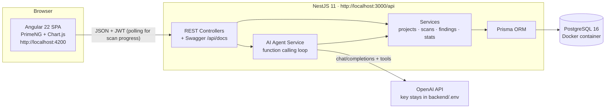

# SecureScan 🛡️

A complete, runnable, corporate-style **security scanning web service (demo)** with:

- **Angular 22 + PrimeNG** frontend (corporate light theme, sidebar navigation, charts)
- **NestJS 11** REST backend with Swagger docs at `/api/docs`
- **PostgreSQL 16** in Docker, accessed via **Prisma ORM**
- Simulated **SAST / DAST scans** with live progress, realistic dummy findings, review workflow with audit trail
- A statistics **dashboard** computed live from the database
- A built-in **AI Assistant** (OpenAI function calling) that can operate the whole app in plain English — with a demo-mode fallback so everything works **without** an API key

Everything is free / open-source (MIT & Apache-2.0 licensed tools only). Runs on Windows, macOS and Linux.

**Demo login: `admin` / `admin`**

---

## Table of contents

1. [What you need to install (prerequisites)](#1-what-you-need-to-install-prerequisites)
2. [Running the app, step by step](#2-running-the-app-step-by-step)
3. [Where to put your OpenAI API key](#3-where-to-put-your-openai-api-key)
4. [Taking a tour of the app](#4-taking-a-tour-of-the-app)
5. [Troubleshooting](#5-troubleshooting)
6. [Architecture overview](#6-architecture-overview)
7. [Technical choices explained](#7-technical-choices-explained)
8. [Licenses](#8-licenses)

---

## 1. What you need to install (prerequisites)

You need three things: **Node.js 24 (LTS)**, **Docker Desktop**, and a terminal. The Angular and NestJS CLIs are used through `npx`, so you don't have to install them globally (optional commands are shown anyway).

> ⚠️ **Node version matters.** The Angular 22 CLI requires a recent Node.js (v22.22.3+, or v24.15+). Installing **Node 24 LTS** is the simplest safe choice.

### Windows

1. **Node.js 24 LTS**
   - Go to https://nodejs.org, download the **24 LTS Windows Installer (.msi)** and run it (keep all defaults, including npm).
   - Verify — open **PowerShell** (Start menu → type "PowerShell") and run:
     ```powershell
     node -v    # should print v24.x.x
     npm -v     # should print a version like 11.x.x
     ```
2. **Docker Desktop**
   - Download from https://www.docker.com/products/docker-desktop/ and install. It may ask you to enable **WSL 2** — accept and reboot if prompted.
   - **Start Docker Desktop** (it must be running, look for the whale icon in the system tray).
   - Verify:
     ```powershell
     docker --version          # e.g. Docker version 27.x
     docker compose version    # e.g. Docker Compose version v2.x
     ```

### macOS

1. **Node.js 24 LTS**
   ```bash
   # Option A – official installer: https://nodejs.org (24 LTS .pkg)
   # Option B – Homebrew:
   brew install node@24
   ```
   Verify: `node -v` → `v24.x.x`, `npm -v` → a version number.
2. **Docker Desktop**
   - Download the Mac version (Apple Silicon or Intel) from https://www.docker.com/products/docker-desktop/, drag to Applications, and **launch it**.
   - Verify: `docker --version` and `docker compose version`.

### Linux (Ubuntu/Debian)

1. **Node.js 24 LTS**
   ```bash
   curl -fsSL https://deb.nodesource.com/setup_24.x | sudo -E bash -
   sudo apt-get install -y nodejs
   node -v && npm -v
   ```
2. **Docker Engine + Compose plugin**
   ```bash
   curl -fsSL https://get.docker.com | sudo sh
   sudo usermod -aG docker $USER   # then log out and back in
   docker --version && docker compose version
   ```

### Optional global CLIs (not required)

```bash
npm install -g @angular/cli @nestjs/cli
ng version      # verify Angular CLI
nest --version  # verify NestJS CLI
```

---

## 2. Running the app, step by step

Open a terminal **in the `securescan` folder** (the folder containing this README). On Windows: open the folder in Explorer, then Shift+Right-click → "Open PowerShell window here", or use `cd path\to\securescan`.

### Step 1 — Start the database (Docker)

```bash
docker compose up -d
```

*What it does:* downloads the PostgreSQL 16 image (first time only) and starts it in the background on port 5432 with user/password/database all set to `securescan`.

*Verify:* `docker ps` shows a container named `securescan-db` with status `Up ... (healthy)`.

### Step 2 — Create the backend config file

```bash
cd backend
# macOS / Linux:
cp .env.example .env
# Windows PowerShell:
copy .env.example .env
```

*What it does:* creates the private configuration file. The defaults already match the Docker database — you don't need to change anything to get started. (You'll paste your OpenAI key here later — see [section 3](#3-where-to-put-your-openai-api-key).)

### Step 3 — Install backend dependencies

```bash
npm install
```

*What it does:* downloads all backend libraries into `backend/node_modules`. Takes 1–3 minutes the first time.

*Verify:* ends without red `ERR!` lines and a `node_modules` folder exists.

### Step 4 — Create the database tables (migration)

```bash
npx prisma migrate dev --name init
```

*What it does:* Prisma reads `prisma/schema.prisma` and creates the tables (users, projects, scans, findings, audit trail) in PostgreSQL.

*Verify:* output ends with something like `Your database is now in sync with your schema` and `Generated Prisma Client`.

### Step 5 — Load demo data (seed)

```bash
npm run seed
```

*What it does:* creates the `admin/admin` user, 6 sample projects, ~15 completed scans and 60+ findings with varied severities and review statuses, so the dashboard looks alive immediately.

*Verify:* prints `Seed complete: 6 projects, 6x findings.` and `Login with admin / admin`.

### Step 6 — Start the backend

```bash
npm run start:dev
```

*What it does:* starts the NestJS API on **http://localhost:3000** in watch mode.

*Verify:* the log ends with:
```
SecureScan backend running on http://localhost:3000
Swagger docs:                 http://localhost:3000/api/docs
```
Open http://localhost:3000/api/docs in a browser — you should see the interactive Swagger API documentation. **Leave this terminal running.**

### Step 7 — Start the frontend (new terminal)

Open a **second terminal**, go to the `securescan/frontend` folder:

```bash
cd frontend     # (from the securescan folder)
npm install     # first time only, takes 1–3 minutes
npm start
```

*Verify:* ends with `Application bundle generation complete` and `Local: http://localhost:4200/`.

### Step 8 — Open the app 🎉

Go to **http://localhost:4200**, sign in with **`admin` / `admin`**.

---

## 3. Where to put your OpenAI API key

The AI Assistant works in two modes:

- **Without a key (default):** demo mode — it understands a few canned commands ("list projects", "start a SAST scan on payments-api", "show critical findings", "show stats") and actually performs them, but it's not a real language model.
- **With your key:** full natural-language agent that can do everything via OpenAI function calling.

**The key lives only on the backend. It is never sent to, or visible from, the browser.**

Step by step:

1. Get a key at https://platform.openai.com/api-keys (it starts with `sk-`).
2. Open the file **`backend/.env`** in any text editor (Notepad is fine). This is the file you created in Step 2 — *not* `.env.example`.
3. Find this line and paste your key **between the quotes**:
   ```
   OPENAI_API_KEY="sk-paste-your-key-here"
   ```
4. (Optional) change the model. The default is an inexpensive one:
   ```
   OPENAI_MODEL="gpt-4o-mini"
   ```
5. Save the file, then **restart the backend**: in the backend terminal press `Ctrl+C`, then run `npm run start:dev` again.
6. Test it: open the chat (sparkle button bottom-right, or the "AI Assistant" page) and type e.g.
   *"Create a project called inventory-service with repo https://git.example.com/acme/inventory, then run a SAST scan on it."*
   You'll see 🔧 action entries in the chat for every operation the agent performs.

> If the key is wrong or expired, the chat shows a friendly error explaining what to check — the rest of the app keeps working.

---

## 4. Taking a tour of the app

1. **Dashboard** — KPI cards (open findings, critical open, scans this month, mean findings per scan) and four charts (severity donut, findings-over-time line, status bar, top vulnerable projects). All numbers come live from PostgreSQL via `/api/stats/overview`.
2. **Projects** — searchable, paginated table. Create/edit via the dialog (name and repository URL are validated). Click a row to open the detail page.
3. **Project detail** — press **Start SAST scan** or **Start DAST scan**. The scan goes `QUEUED → RUNNING → COMPLETED` over ~10 seconds; the table refreshes automatically every 2 seconds while a scan is active.
4. **Findings** — filter by severity, status, project or free text. Click a finding for the full detail: description, CWE, exact location (file:line for SAST, URL for DAST), recommendation.
5. **Finding detail** — change the status (`OPEN → CONFIRMED / FALSE_POSITIVE / ACCEPTED_RISK / FIXED`) with an optional comment. Every change is recorded in the **audit trail** (who, when, old → new).
6. **AI Assistant** — floating chat on every page (sparkle button) plus a full-size page. Try: *"Show me all critical open findings in payments-api"*, *"Mark finding 42 as false positive with comment 'input is sanitized'"*, *"How many scans ran this month?"*
7. **Swagger** — http://localhost:3000/api/docs. Click *Authorize*, paste the token from the login response to try endpoints directly.

---

## 5. Troubleshooting

**1. `docker: command not found` or `error during connect / cannot connect to the Docker daemon`**
Docker Desktop isn't running. Start Docker Desktop (Windows/macOS) and wait until the whale icon says "running", then retry. On Linux: `sudo systemctl start docker`.

**2. `Bind for 0.0.0.0:5432 failed: port is already allocated`**
Another PostgreSQL is already using port 5432. Either stop it, or edit `docker-compose.yml` and change `"5432:5432"` to `"5433:5432"`, then in `backend/.env` change the URL to `...@localhost:5433/...`.

**3. Backend says `EADDRINUSE: address already in use :::3000` (or 4200 for the frontend)**
Something else uses that port — often a previous run that didn't close. Find and stop it:
- Windows: `netstat -ano | findstr :3000` then `taskkill /PID <pid> /F`
- macOS/Linux: `lsof -i :3000` then `kill <pid>`
Or change `PORT` in `backend/.env`.

**4. `Can't reach database server at localhost:5432` (P1001) during migrate/seed/start**
The database container isn't up. Run `docker compose up -d`, wait ~10 seconds, check `docker ps` shows `securescan-db (healthy)`, then retry.

**5. `Environment variable not found: DATABASE_URL`**
You skipped Step 2. Copy `.env.example` to `.env` inside the `backend` folder (the file must be named exactly `.env`).

**6. The AI chat says the key is missing/invalid**
Check `backend/.env`: the line must be `OPENAI_API_KEY="sk-..."` with no spaces around `=`, and you must **restart the backend** after editing. A `401` message means OpenAI rejected the key (typo, revoked, or no billing on the account).

**7. Browser console shows CORS errors**
The backend only allows `http://localhost:4200`. Make sure you open the app at exactly that address (not `127.0.0.1:4200`) and that the backend is running on port 3000. If you changed ports, update `enableCors` in `backend/src/main.ts`.

**8. `The Angular CLI requires a minimum Node.js version ...`**
Your Node is too old. Install Node 24 LTS (see prerequisites), close and reopen the terminal, verify with `node -v`, then run `npm install` again in `frontend`.

**9. `npm error code ERESOLVE` during `npm install`**
Usually caused by a very old npm/Node. Upgrade to Node 24 (which brings a modern npm), delete the `node_modules` folder and `package-lock.json` in that directory, and run `npm install` again.

**10. Login fails with "Invalid username or password"**
The seed didn't run. Run `npm run seed` in `backend` (with the database up) and log in with `admin` / `admin`.

**11. Data looks broken / want a fresh start**
```bash
docker compose down -v      # deletes the database volume
docker compose up -d
cd backend
npx prisma migrate dev --name init
npm run seed
```

---

## 6. Architecture overview



- **Auth:** demo JWT login (`admin/admin`, bcrypt-hashed in the DB). A global guard protects every endpoint except `/auth/login`; the Angular interceptor attaches the token to every request.
- **Scan simulation:** starting a scan creates a `QUEUED` record; a background job flips it to `RUNNING` after ~3 s and to `COMPLETED` after ~5–7 s more, then generates 5–13 realistic findings. The frontend **polls every 2 seconds** while a scan is active.
- **AI agent:** the backend sends the conversation plus 8 tool definitions (create/list/update projects, start scans, query scans/findings, change finding status, get stats) to OpenAI. When the model requests a tool, the backend executes it against the same services the REST API uses, feeds the result back, and loops until the model answers. Every mutating tool call is returned to the UI as a 🔧 action line.
- **Shared contracts:** the Angular `core/models.ts` types mirror the Prisma models and DTOs 1:1.

Folder structure:

```
securescan/
├── docker-compose.yml        # PostgreSQL (and optional backend container)
├── backend/                  # NestJS + Prisma
│   ├── .env.example          # copy to .env; OpenAI key goes here
│   ├── prisma/schema.prisma  # database schema
│   ├── prisma/seed.ts        # demo data
│   └── src/
│       ├── auth/  projects/  scans/  findings/  stats/  ai/
│       └── main.ts           # bootstrap, CORS, validation, Swagger
└── frontend/                 # Angular standalone app
    └── src/app/
        ├── core/             # api/auth services, guard, interceptor, shared types
        ├── layout/           # sidebar shell + floating AI chat
        ├── chat/             # shared chat panel + state
        └── pages/            # dashboard, projects, scans, findings, assistant, settings
```

## 7. Technical choices explained

- **Prisma over TypeORM** — fully type-safe queries generated from one schema file, plus the simplest migration/seed workflow for beginners (`prisma migrate dev`, `npm run seed`).
- **Polling over WebSockets** for scan progress — scans finish in seconds and a 2-second poll is trivially simple to understand and debug, with no extra server infrastructure; WebSockets would add complexity without visible benefit here.
- **PrimeNG `p-chart` (Chart.js)** for charts — MIT-licensed, ships with the UI library already in use, zero extra integration code.
- **Raw `fetch` to the OpenAI API** instead of an SDK — one fewer dependency, and the function-calling loop stays fully visible in ~80 lines (`backend/src/ai/ai.service.ts`).
- **Custom lightweight JWT guard** (no Passport) — the demo needs exactly one login route; a 40-line guard is easier to read than a strategy framework.

## 8. Licenses

All runtime dependencies are free and open source:

| Component | License |
|---|---|
| Angular, Angular CLI | MIT |
| PrimeNG, PrimeIcons, PrimeFlex, @primeuix/themes | MIT |
| Chart.js | MIT |
| NestJS (+ @nestjs/*) | MIT |
| Prisma ORM / @prisma/client | Apache-2.0 |
| PostgreSQL 16 | PostgreSQL License (BSD-style) |
| class-validator, class-transformer | MIT |
| bcryptjs | BSD-3-Clause |
| RxJS | Apache-2.0 |
| TypeScript | Apache-2.0 |
| zone.js, tslib | MIT / BSD-0 |

This project itself: MIT. The OpenAI API is an optional external service you pay for with your own key; the app runs without it (demo mode).
